**The PiTrac Assembly Guide**

Overview:  
This document explains the process of building a typical PiTrac DIY Launch Monitor (LM).  This process includes the assembly of all of the physical components, including the 3D-printed parts and hardware, such as cameras and Raspberry Pi computers.  Detailed printing instructions for the 3D parts are contained in the directories that have the respective part files.  Instructions for certain stand-alone sub-assemblies such as the camera mounts are contained in separate documents, but linked to from this main document.  Instructions for the software components of the LM are separate and available [here](https://github.com/jamespilgrim/PiTrac/blob/main/Documentation/Raspberry%20Pi%20Setup%20and%20Configuration.md).

This document also refers to the calibration steps for the camera sub-system, which should be consulted prior to building the enclosure.  This calibration is most easily done *as the LM is being assembled*, because doing so allows for easier access to the cameras and camera mounts before the LM is completed.  The calibration process can be found [here](https://github.com/jamespilgrim/PiTrac/blob/main/Documentation/PiTrac%20-%20Camera%20Calibration.zip).

At least currently, the LM is not a simple, complete kit that just requires attaching Part A to Part B.  Instead, it’s a general design for an LM that we hope the builder will customize, adapt and improve depending on their own goals and skills.  The particular parts referenced here may not even be available when someone builds the LM. For that reason, this document is less of a plan and more of a guide for building what is expected to be a ‘typical’ PiTrac LM.  The authors hope that the individual creativity, and ingenuity of the builders will help improve PiTrac and help it continue to evolve.

Conventions:  
Any references to left/right/back/front in this document are by default referring to the LM as it faces the user, with the camera side toward the builder.  “Pi-side” refers to the right half where the Pi’s, cameras, and the Connector Board are placed.  “Power side” refers to the left side where the power adapters and cables are contained.

The 3D parts are named using a house analogy.  The curved parts that make up the outside of the LM are referred to as walls.  The flat horizontal parts that will be mounted within those walls are called floors.  Some additional terminology is shown below:  

Tools Needed:

1. M2.5, M3, M4, and M5 hex wrenches.  Right-angle wrenches as well as straight (screw-driver-type) wrenches are helpful.  
2. Needle-nose pliers.  
3. Medium-sized Phillips screwdriver, at least a 6” length  
4. Soldering tools  
5. Wiring tools such as wire strippers, clippers, and anything necessary to build custom wiring harnesses  
   1. If custom-making the harnesses ribbon cable, a pin connector kit, crimping tool, etc.  
6. Optional:  
   1. A magnifying, lighted headband and/or a magnifying desk light  
   2. A Dremel tool can come in handy for trimming parts if needed.  
   3. A soft/hard rubber hammer or mallet.  Because sometimes things need a little gentle persuasion.

Parts  and Materials:

1. See the [parts list document](https://github.com/jamespilgrim/PiTrac/blob/main/Documentation/PiTrac%20-%20DIY%20LM%20%20Parts%20List.md) for a full list of parts, including all of the bolts and screws  
2. The 3D-printed parts that make up the enclosure (of course).  
3. Solder, flux, flux-cleaner  
4. Wires.    
   1. We use stereo-speaker wire for higher-voltage portions of the system and whenever keeping the two \+/i wires together for most of the wire-run is helpful.  
5. Optional:  
   1. Sand paper, sanding block  
   2. To use as a contrasting backdrop, a half-dozen (or so) square feet of non-IR-reflective cloth material, such as most black felts  
      1. You’ll have to experiment with what types of cloth show up as black when lit with IR light.  Some cloth that appears black to the eye actually looks white in IR light, which makes a poor-contrasting backdrop with a white-colored ball.

Assembly Instructions:

1. Printing the Enclosure Components  
   1. First, see the individual printing and assembly instructions for each of the 3D parts that make up the LM, [here](https://github.com/jamespilgrim/PiTrac/tree/main/3D%20Printed%20Parts/Enclosure%20Models). The 3D printing is a multi-day project in itself due to the size of some of the parts.  
   2. If possible, having the hardware components that you expect to use in hand ***before*** printing the parts will allow you to customize the part models as necessary to fit those parts.  For example, if your LED power supply is different from the one used by the authors, you’ll want to customize the mounting risers and holes on the Pi-Side Base layer to accommodate it.  
2. Base Layer (the part of the LM that touches the ground\!\!)  
   1. Overview  
      1. Several parts such as the LED power supply will be placed in the lowest section of each of two Base Layer wall parts first.  Then, the two base wall parts are connected together in the middle.  The camera assembly and Pi 2 are then attached to the Pi-side Floor.  Finally, the Pi-side and power-side floors are screwed into the mounting risers on the inside of the walls.  
   2. Wall Halves and Lower Component Bays (the areas just above the floor)  
      1. Before putting anything in the base bays, place two M3 nuts into the indents on the Pi-side half-join pads while there is still room to do so.  If tight, the nuts can be pulled into the indents by using a temporary bolt from the outside.  A little temporary scotch tape really helps hold the nuts in.  
      2. It’s easier to install the LED supply before the two bottom wall halves are joined.  The part is typically heavy, so best to keep it low in the enclosure.   
      3. Place the LED power supply in the right-hand half and secure to the risers on the floor with four M4 x 12 screws.  The design is set up to accommodate [this supply](https://www.aliexpress.us/item/2251832563139779.html), though others should work.  Different supplies will require different distances between the LED supply riser mounts, of course.    
      4. The output wires of the supply should have a quick-connect to make it easier to connect to the Connector Board later.  Make sure the polarity of the two wires is clearly marked.  Putting polarity markings on the quick-connect helps.  The input should have a 3-prong plug that can be plugged into a utility strip on the power-side of the LM.    
      5. If your network switch will fit and still allow for cable connections, place it in the Power-side bay now.  One cable will be routed out the back of the LM, and two cables will lead from the switch over to the Pi’s on the right side of the LM.  
         1. It may be easier to lay down two Cat-5/6 cables through the Pi-Side bay now rather than after the floor is attached.  They may be threaded between the LED power supply and the base floor later (see completed Base Layer, below)  
      6. Join the two base halves using two pairs of M3 x 16mm bolts and nuts.  
   3. External (Tee-up) LED lighting  
      1. Install LED lighting under the overhang near the bottom of the Base Layer.  This lighting helps the high-FPS camera 1 see the ball more clearly despite the short shutter speeds.  This can be done after mounting the floors, but it’s more difficult.  However, the pictures below show the LED strips being installed after the floor.  Because we messed up.  
      2. If you’re using [the same LED strips we are](https://www.amazon.com/Aclorol-Powered-Daylight-Flexible-Backlight/dp/B0D1FYV3LM/ref=asc_df_B0D1FYV3LM?mcid=70db06b6e26231f3961ef52c9615b991&hvocijid=2003913134214569652-B0D1FYV3LM-&hvexpln=73&tag=hyprod-20&linkCode=df0&hvadid=721245378154&hvpos=&hvnetw=g&hvrand=2003913134214569652&hvpone=&hvptwo=&hvqmt=&hvdev=c&hvdvcmdl=&hvlocint=&hvlocphy=9028778&hvtargid=pla-2281435177378&psc=1), it’s best to make it brighter by using two levels of stripping.  To do this, start by tacking down one end of the strip on the left-side of the Base Layer under the overhang.  Position it so the end goes inside the LED light port by a few inches     
      3. 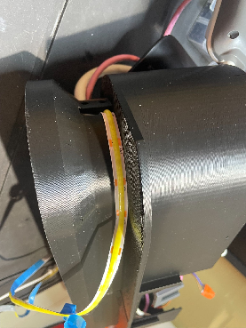  
      4. Then, remove the sticky backing and stick one layer down just below the overhang, making a small, loose bend that is pushed about 4 inches into the right-hand LED port.  Stick down the next layer of the strip just below the first layer so that there are two rows of LED lights under the overhang.  
      5. 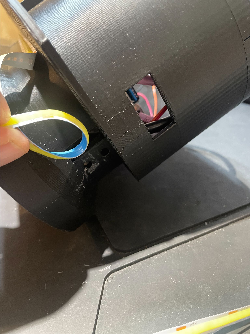 
      6. Pull the end of the LED strip that has the USB (or whatever) power plug through the left-most LED port.  This end will either plug into the power strip within the PiTrac, or (usually better), will be pulled back out the back port that has the main power cable and the network cable.  Doing so allows the power to stay on to the Pis and the rest of the monitor, but the LED strip can be turned off when the ball is not actively being hit.  It’s quite bright and can get warm, so it’s nice to be able to turn it off.  
      7. Use the two small holes at the ends of the Base Layers to thread zip-ties through.  Use the zip-ties to (lightly) secure the ends of strips.  If your LED strip is super-sticky, you may not need the zip-ties.  
      8. 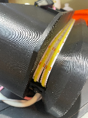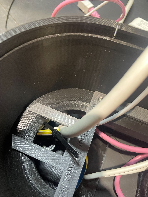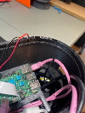  
   4. Camera 2 (the camera on the bottom that takes pictures of the ball in flight)  
      1. Camera modifications  
         1. First, one [GS camera](https://www.raspberrypi.com/products/raspberry-pi-global-shutter-camera/) has to be modified to (1) use IR light instead of visible light, and (2) to allow for external triggering of its shutter .    
            1. **WARNING** \- these modifications will void the warranty on the camera.  They are also pretty delicate, and can wreck the camera if performed incorrectly  
         2. Remove the internal IR filter that would otherwise keep any IR light from entering the sensor.  Use [official instructions here](https://www.raspberrypi.com/documentation/accessories/camera.html#filter-removal).  
         3. Modify the Global GS Camera to accept external triggering.  Use the [instructions from RPi](https://github.com/raspberrypi/documentation/blob/develop/documentation/asciidoc/accessories/camera/external_trigger.adoc) as a guideline. The removal of the resistor is a particularly difficult step, and you’ll want to use a good magnifying work light and some steady hands\!  
         4. Because you’ll likely be connecting and disconnecting the camera several times, use wires with jumper pin ends (or other quick-connect devices) to make the process easier.    
         5. 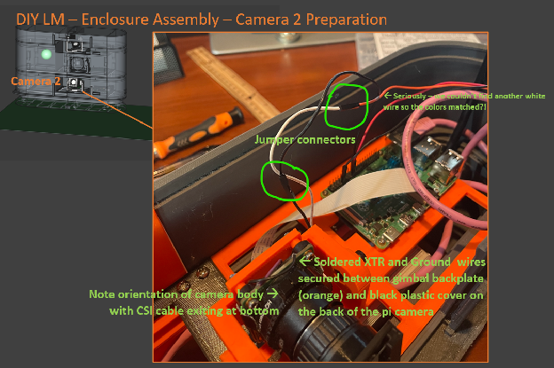 
         6. This is the most delicate part of the entire DIY LM assembly process, so work slowly.  Removing the extra resistor is especially difficult, so consider practicing first on an old surface-mount PCB that you don’t use any more. (doesn’t everyone have those?:)  
         7. Once the XTR and GND wires are soldered to the board, add a small drop of thick glue over the wire and solder to help act as a strain relief.  Also for strain relief, we ran the wires down from the top of the camera (see picture above) and gently pinched the wires between the camera and the backplate of the camera gimbal assembly.  Doing so protects the wires a bit by having them come out near the bottom of the gimbal away from other things they might snag on.  
      2. Assemble the Pi GS Camera and its gimbal camera mount for the bottom camera 2  
         1. NOTE:  The bottom camera mount is shorter than the top camera mount because the bottom camera (camera 2\) does not need to point downward  
         2. Use the instructions in the Camera Mount sub-project’s README.md file [here](https://github.com/jamespilgrim/PiTrac/tree/main/3D%20Printed%20Parts/Enclosure%20Models/Pi-Camera-Mounts).  
      3. Mounting the camera to the gimbal  
         1. It is easier to attach the camera CSI cable ***before*** bolting the camera to the camera assembly’s backplate.  Make sure the cable-lock is locked on the camera so that the ribbon cable doesn’t fall out..  
         2. Carefully thread the CSI ribbon cable out the back of the camera mount making sure it does not get pinched between the backplate and the gimbal mounting base.  
      4. Add visible-light cut filter  
         1. Assemble the filter holder by gluing the two parts of the filter together using the registration wings to position the two parts together.:  
         2. 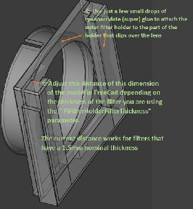 
         3. See instructions [here](https://github.com/jamespilgrim/PiTrac/tree/main/3D%20Printed%20Parts/Enclosure%20Models/Pi-Camera-Light-Filter-Holder).   
         4. Insert the visible light-cut filter and attach the holder to the lens with the opening at the top so the filter doesn’t drop out  
   5. Pi-side Base Layer Floor  
      1. NOTE:  The two floors holding the RPis are similar.  Double check the labeling on the part to ensure the correct floor is used in each step  
      2. Mount Camera 2 on Floor 1 using an M5 bolt and nut.  It’s best to have the CSI cable and GND and XTR (external trigger) wires all in place and secure before mounting.  
      3. Mount the Pi 4 (a 5 works, too) on the right side of Floor 1 using 4 M2.5 x 12 bolts and nuts, with the nuts on the bottom side.  Put the Micro-SD card (if used) in place beforehand when it’s more accessible.    
      4. Connect the camera’s flat CSI cable to the Pi.  
      5. Connect the camera’s GND to pin 9 of the Pi.  
      6. Create the Pi 2-to-Connector-Board ribbon cable and plug it in  
         1. To do so, fashion a three-wire ribbon cable harness with female plugs on each end.  If possible, have a black and a red wire, with the third wire for the Camera 2 XTR.  See the lower half of this photo for finished wiring:  
         2. 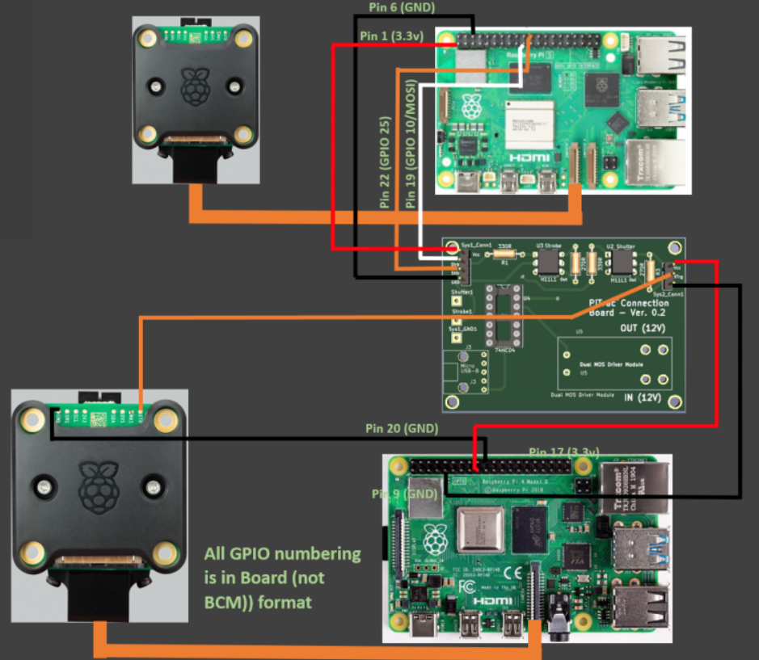
         3. NOTE \- Low-quality wiring harnesses in this part of the build can lead to random, difficult-to-diagnose problems later.  Make sure that the wiring harnesses will connect firmly and without any play to the pins on the Connector Board.  Making the cables a little longer than necessary also makes life easier.  
         4. Pre-crimped ribbon cable parts are by far easier to use than having to solder your own.  See [here](https://www.amazon.com/Kidisoii-Dupont-Connector-Pre-Crimped-5P-10CM/dp/B0CCV1HVM9/ref=sr_1_2_sspa?crid=82PRY332YY24&dib=eyJ2IjoiMSJ9.QGbaFF62mgZ1Tf0J7CajkKXRwTNzXfW_5IJDpp-KFNMSPxr3NJETCkY5IC0OIC6NydeuYNxh2IMnpu14CuIxCxLVt4T4kUKlsGMMPk0uwwu7oKUnh2qI2YGvPNmbGfKPCZE6EYSST4_MDqKRP2VMQDk5slq7dKh0rdLvqEMAjboPrVlVx0sd3ShyQsdiUN9ljqd6q-bfi_ZVY2jKoBiwVuMgkZs-BkA3jRBQvkzWpos.aLN0QbPnnKDjbELWeYKRE5SrUWDe-Ivk47o6BkYfL04&dib_tag=se&keywords=ribbon+cable+with+female+connectors&qid=1733175902&sprefix=ribbon+cable+with+femaleconnectors%2Caps%2C143&sr=8-2-spons&sp_csd=d2lkZ2V0TmFtZT1zcF9hdGY&psc=1) for an example assortment kit.  
         5. An example (with more intermediate connectors than necessary) is:  
         6. 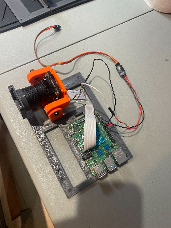 
   6. Joining the two Base Layer Floor halves  
      1. The two base-floor halves join in an overlapping lap joint in the middle.  The lap joint helps secure the two halves of the LM together.  
      2. Ensure that any printing supports on the power-side floor lap joint are removed and that the joint is smooth and will mate well with the pi-side floor.  A careful belt-sanding may help.  
      3. 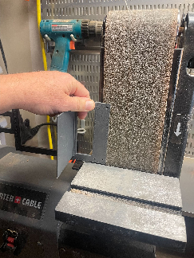
      4. Start by screwing 6 M3 x 10mm screws a few turns into the 4 holes on the power-side floor and the right-most (outside) 2 holes on the Pi-side floor.  It’s easier than placing them later  
      5. Slip the lap joint of the Power-side floor between the camera base and the lap joint of the Pi-side floor so that the right-most screws of the power-side are aligned with the left-most two holes on the Pi-side.  It will likely be a little tight.  Screw just the two screws in the overlapping holes so that the two sides are held (barely) together.  This process is easier than trying to join the two floors after they are both placed inside the base walls.  
      6. Set the tenuously-joined Pi-side Floor 1 and Pi-side Floor into the joined Base-Layer walls, with the Pi on the right..  The lap-joint (and two screw holes) should be aligned in the middle.   
      7. Screw the floors into the mounting pads on the side of the walls using M3 x 10mm screws.  Note that the two screws on the lap joint go through both floors and into the side pads of the Pi-side wall.  
      8. Make sure any cables you will need later such as network cables are not trapped or pinched.  Also make sure the LED Power Supply power cable is accessible on the left side.  
      9. The joined base layer assembly will look like:  
      10. 
   7. Completing the Base Layer  
      1. Run the power cable from whatever power-strip will be used down through the left-most power-strip support and down and out the hole on the power-side base.  This is usually a tight fit, so do it first.  
      2. Route a power cable from the Pi power supply to the Pi 2 computer board.  It may be a little tight with the network cables.  
      3. Route one of the network cables to the Pi.  
      4. The completed Base (lowest) Layer should look similar to:  
      5. 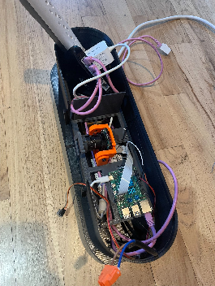 
      6.   
      7. Preparation for Middle Layer  
         1. In preparation for mounting the Middle Layer on the Base Layer, gently move the cables that will connect from the Base Layer to components in the Middle (and above) layers:  These cables include:  
            1. Network cable from the network switch (will connect to the Pi 1 on the upper floor of the Middle Layer)  
            2. 3-wire wiring harness from the Pi 2 on the base layer (will connect to the Connector Board on the lower floor of the Middle Layer  
            3. LED strobe power cable from the LED power supply in the Base Layer (will connect to the LED strobe on the lower floor of the Middle Layer  
         2. Each of these cables typically are routed off to the right.  
   8. Camera 2 Calibration  
      1. Now is the time to calibrate Camera 2\.  The camera is easily accessible at this point, and it will be more difficult to deal with once the Middle Layer of the LM is in place above it.  
      2. See Calibration Document [here](https://github.com/jamespilgrim/PiTrac/blob/main/Documentation/PiTrac%20-%20Camera%20Calibration.zip).  
3. Middle Layer assembly, including Second (middle) and Third (top) floors  
   1. Overview  
      1. Like the Base Layer, the Middle Layer consists of two wall halves that join together in the middle.  However, there are two floors on the right (Pi) side in the Middle Layer.  The lower Pi-side floor holds the strobe LED and the Connector Board.  The upper floor holds the Pi 1 computer and Camera 1\.  The wall halves are joined first.  Then, the components are attached to the Pi-Side lower floor half, and then the Pi-side and Power-Side Lower Floors are secured to the lower part of the Middle Layer.  Inter-floor wiring is completed, then the Pi-side Upper Floor is put in place in its respective half above the Lower Floor.  
   2. Build the Strobe Assembly  
      1. See Strobe Mount instructions [here](https://github.com/jamespilgrim/PiTrac/tree/main/3D%20Printed%20Parts/Enclosure%20Models/LED-Array-Strobe-Light-Mount).  
   3. Build the Connector Board  
      1. See Connector Board instructions (separate project) [here](https://github.com/jamespilgrim/PiTrac/tree/main/Hardware/Connector%20Board).  
      2. Ensure the two 12V IN and OUT wiring pairs and the 4-wire harness is attached to the Connector Board’s screw terminals before mounting the Floor to the Wall half  
         1. Attaching the wiring harnesses to the Connector Board on the ***lower*** floor early is essential because it is difficult to access the board once the ***top*** layer Pi-side floor is installed.  
         2. The 3-wire harness should already have been attached to the Pi 2 and the Pi Camera 2 in the Bottom Layer  
   4. Joining the Middle Layer Wall Halves  
      1. Place four M3 nuts into the indents on the Pi-side half-join pads.  If the fit is tight, the nuts can be pulled into the indents by using a temporary bolt from the outside.  Tape can help hold the nuts in their indents.  
      2. Join the two base halves using four pairs of M3 x 16mm bolts and nuts.  
      3. If necessary, disconnect the two sides and sand the half-join areas to ensure the two halves come together tightly without unsightly gaps.  
   5. Build the Middle Layer Lower Floor (Strobe & Connector Board) Assembly  
      1. Mount the Connector Board to the Lower Floor so that the 4-pin connection header is on the left and the writing is upright.  Mount the Board with four self-tapping M3 x 8mm or 10mm screws.    
      2. Mount the strobe assembly (LED and gimbal) using an M5 bolt that comes up from below the floor through an M5 nut in the indent in the base below the LED strobe light.  Position the LED power wires so that they lead back through the side wire holders on the Strobe Assembly.  Face the strobe straight out from the LM and tighten the M5 bolt now while it is easily accessible.  
   6. Mount the Lower Pi-side and power-side Middle Layer floors to the bottom of the lower mounting pads on the side of the Middle Layer walls.  
      1. Both of the lower floors mount on four screw holes on the ***underside*** of the lower floor mount pads using four self-tapping M3 x 10mm screws.  Do not over-tighten.  Note that the floor is below the pads, but the components are on the upper side of the floor.    
      2. The Middle Layer (without the 3- and 4- wire wiring harnesses or power) with the two lower floors looks like:  
      3. 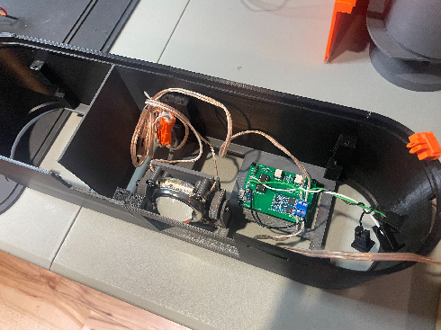  
      4. Now is the time to route a 5V micro-USB power cord to the Connector Board and attach it.  Whatever 5V adapter is left on the left side bay.  
   7. Assemble the Camera 1 camera assembly  
      1. This assembly is similar to the Camera 2 assembly, but Camera 1 will be pointing downward fairly steeply, so the Camera 1 assembly has the camera mounted a little higher on a taller riser than the other camera.  Make sure you use the correct camera assembly so that the camera can point at a downward angle.  See the Camera Mount Assembly instructions, [here](https://github.com/jamespilgrim/PiTrac/tree/main/3D%20Printed%20Parts/Enclosure%20Models/Pi-Camera-Mounts): See photo below::   
      2. 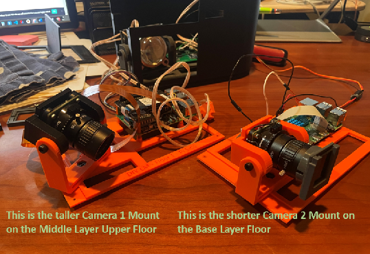 
      3. Camera 1 uses visible light, so no external filter or modifications are necessary.  
   8. Assemble the Pi-side Middle Layer Upper Floor  
      1. **NOTE**\- this step follows the directions for the ***Base*** Layer Pi-side floor pretty closely, since both of these floors have a Pi and a Pi camera..  The two floors holding the RPis are similar.  Double check the labeling on the part to ensure the correct floor is used in each step  
      2. Mount the Camera 1 Assembly on the Middle Layer Upper Floor using an M5 bolt and nut.  It’s best to have the CSI cable in place and secure before mounting.     
         1. **NOTE:** Camera 1 uses a different adapter cable than Camera 2\.  
         2. See photo, above.  
      3. Mount the Pi 5 on the right side of Floor 1 using 4 M2.5 x 12 bolts and nuts, with the nuts on the bottom side.  Put the Micro-SD card (if used) in place beforehand when it’s more accessible.    
         1. Because we expect this Pi 5 to be used as a development platform in addition to being an operational part of the PiTrac, using an NVmE memory instead of an SD card is recommended.  An active cooler is also a good idea for those long compiles.  
      4. Connect the camera’s flat CSI cable to the Pi 5\.  Note that a special cable is necessary here because the Pi 5 uses a smaller size-format connector.  
   9. Mounting the Pi-side Middle Layer Upper Floor to the Middle Layer Wall  
      1. After confirming that both wiring harnesses are connected to the Connector Board, guide the 4-wire harness and the second network cable  to the right of the upper floor as you place the upper floor on the four mounting pads of the Pi-Side Middle Wall.  This will enable those wire wires to be connected to the Pi 1 on the Middle Layer upper floor.  
      2. Mount the upper floor to the side pads using four M3x10mm self-tapping screws.  
      3. Connect the 4-wire ribbon cable from the left side of the Connector Board in the lower floor to the GPIO pins of the Pi 1 computer on the upper floor.  See the upper part of the wiring diagram here:  
         1.  
      4. Connect the second network cable to the Pi from the switch in the base layer  
      5. Connect a Pi-5 compatible power supply (we used [this one](https://www.amazon.com/CanaKit-PiSwitch-Raspberry-Power-Switch/dp/B07H125ZRL/ref=sr_1_4?crid=VQOV0R8XMNA0&dib=eyJ2IjoiMSJ9.AIdxZFc5tMLjKfCV9BEe403XELKsVK5ndYzxw68q3PbGDjPo9KQm1JsQqA1h6nNjDr0lR4B1gYTxx-xvP7ZNO3E-kw8olMpPmL3hOKJjZhHnerTOlTQBX3TPetkPZKHA4ANA88ZTNG_YMrLZKe9axLtBJSPC7yRtBsvcTH4q1eVb0Z5MGtRBbrFwjlwdPpKkCfFPXzmvqDFG4EceescwS9N5JDTKTBLBxfHe16GA5Kw.Z_0SKpqLaqnW-tz8_Xk9G0eAQ5kLujm9s-PL9_7gYvg&dib_tag=se&keywords=pi+5+power+supply&qid=1733787377&sprefix=pi+5+power+supply%2Caps%2C138&sr=8-4)) from the Power-Side to the Pi 5\.  Try to keep the cable out of the way of the strobe and other hardware on the lower layer beneath.  
      6. The Pi 5 should be operational at this point and the camera ready to be calibrated.  
   10. Middle-Layer Power-Side Assembly on the Middle Wall  
       1. There is no upper floor for the Middle-Layer power side.  The lower floor’s separator wall is high enough to partition off the entire power-side of the Middle Layer.  
   11. Mount the Middle Layer on the Base Layer (it’s really coming together now\!)  
       1. Before connecting the MIddle and Base Layers, make sure you have the wires from the Base Layer (especially the 3-wire harness) that will connect to the Connector Board in the Middle Layer.  
       2. Grip the Middle Layer securely by its back wall and hold it above the Base Layer with one hand so you can move things around with your other hand..  
       3. Push the network, LED power output, and Connector Board wiring harness off to the right of the Base Layer and thread them through the space on the right side of the Middle Layer as the Middle Layer is placed into position on the Base Layer.  These cables need to be connected to the components of the upper floor of the Middle Layer.  
          1. On the left-hand side: Guide whatever utility strip and power adapters you are using up through the void on the left side of the Middle Layer.  
          2. On the right-hand side: Thread the cables coming up from the Lower Layer through the space on the far-right of the Middle Layer, just to the right of the lower floor.  See below for what this should look like as we start to put the two layers together:  
       4. 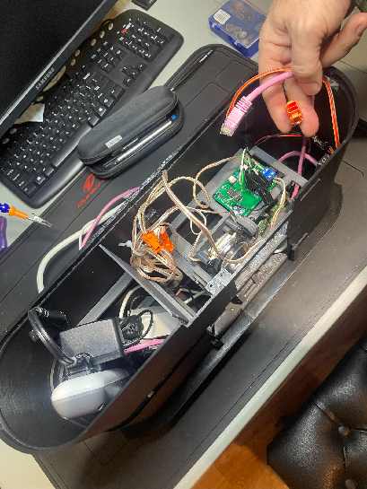 
       5. ***BEFORE*** trying to fully connect (snap together) the two layers, make sure that all of the various wires are well inside the walls and will not be pinched or cut between the layers when they come together\!  
       6. Gently insert the inner-wall click-tabs at the bottom of the Middle Layer into the inside of the wall tabs at the top of the Base Layer.  It’s often easier to set the upper layer into the back of the lower layer and then pull outward on the front of the Base Layer to help the top layer tabs click into the Base Layer.  
       7. Resist the temptation to hit the top–most layer down into the base layer.  And NOTE \- the top of the MIddle Layer is fairly sharp\!  
   12. Connect the output of the LED power supply in the Base Layer to the wires screwed into the Dual MOS switch of the Connector Board – marked as “IN (12V)”  
       1. **WARNING** \- Check and then double-check that the polarity of the wires is correct.  Using wires that have clear markings (such as a white-strip on one wire of a wire pair) helps.  If the LED is connected backward, it could be destroyed.  
       2. Using ‘keyed’ wire connector blocks that can only be connected in one way  (and not flipped) is a sound practice.  
       3. Most of the MOS switches that can be used with the Connector Board will have polarity markings on the MOS switch board.  For example, see below:  
       4. 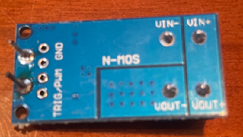
       5. 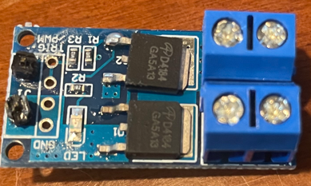 
       6. Note however, that the components you source may be different\!  
   13. Connect the wire leads from the “OUT (12V)” terminals of the Connector Board to the  LED Strobe.  
       1. Make sure you don’t accidentally connect the strobe directly to the ***output*** of the LED power supply.  Doing so could melt the strobe assembly or worse.  
       2. Same warning on polarity as above.  
   14. Connect the wiring harness from both the Pi 2 (the Pi on the Base Layer floor) and the Pi Camera 2 from the Base Layer below up to the Connector Board   
       1. Using the schematic layout in the next subsection, below), ensure that the correct wires from the Camera 2 and the Pi 2 in the Base Layer are connected to the correct header pins on the Connector Board  
4. Securing the Base and Middle Layers  
   1. Secure the layers using M3 x 6mm self-tapping screws in the four screw holes at the interfaces of the bottom of the Middle Layer and the top of the Base layer.  Dulling the tips of the inter-floor screws (which currently overhang into the layer interiors) for safety is a good idea.  
5. Camera 1 Calibration  
   1. Prior to putting the ceiling over the upper camera 1, calibrate that camera using the separate Camera Calibration document [here](https://github.com/jamespilgrim/PiTrac/blob/main/Documentation/PiTrac%20-%20Camera%20Calibration.zip)  
6. Top Wall (Ceiling) section assembly  
   1. Connect the two ceiling halves using four M3 bolts and screws.  
   2. Snap the ceiling section onto the top of the Middle Layer.  Secure with 4  M3 x 6mm self-tapping screws in the four screw holes at the interfaces of the bottom of the Ceiling Layer and the top of the Middle Layer.  Dulling the tips of the inter-floor screws (which currently overhang into the layer interiors) for safety is a good idea.  
7. Add the Front Window  
   1. Add the protective 15.5cm x 24cm  plexiglass anti-ball-strike window by sliding it down into the mounting slots in the ceiling and base-layers.  The plexi window should be far enough away from the cameras and strobe light so that a ball strike against the window should not hit those expensive components.  
8. PiTrac Badge/Logo  
   1. The PiTrac badge is built from separately printing the back plate of the badge, and the letters (and parts of the “PiTrac” letters) and then putting them together.  
   2. You can pick the colors you’d like to use, of course.  We use the following palette:  
   3. 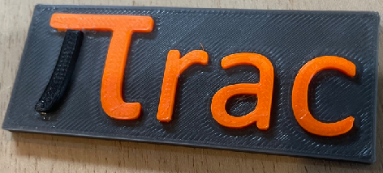 
   4. The parts fit better if they are printed full-sized for the back plate, and at 99% size for the characters.  After printing out the parts shown above, a hard-rubber hammer makes it easy to tap the characters into place.  Friction is enough to hold the parts together, but a little cyanoacrylate glue wicked into the joints will secure them permanently.  
   5. We attach the badge using 2-sided tape, as the rough surfaces don’t glue together very well.  
9. Next step is to go through the Start Up documentation [here](https://github.com/jamespilgrim/PiTrac/blob/main/Documentation/PiTrac%20Start-Up%20Documentation.md).
