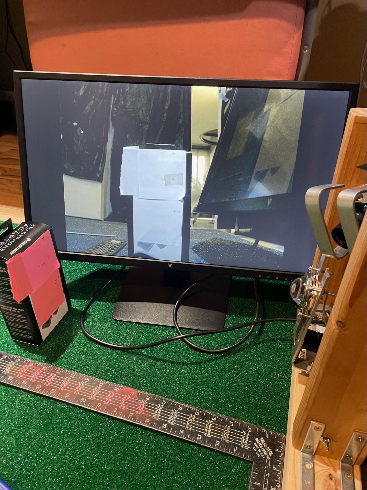
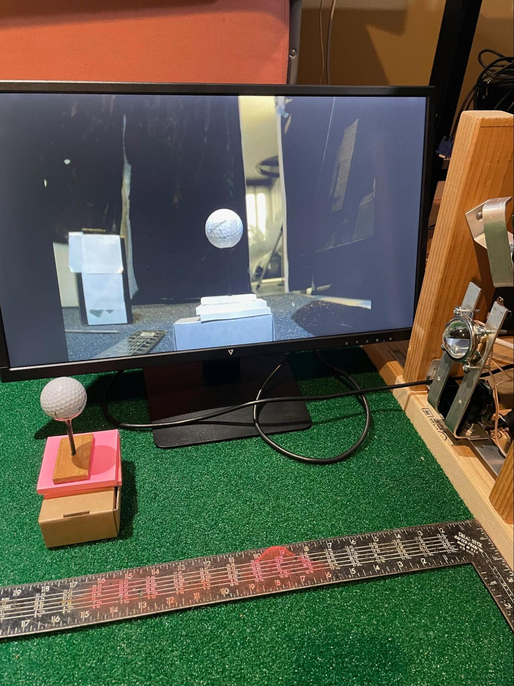

## Camera Calibration

(the below pictures feature PiTrac in its early incarnation using 2x4s for its enclosure)
<table>
  <tr>
    <th></th>
    <th></th>
  </tr>
  </table>

### Overview

1. The PiTrac system needs to know the angles of the cameras and the relative distances between them in order to locate the ball in space. Camera calibration helps establish these values.

2. During this calibration, various distances are measured from each camera to a test point in front of the camera. Those values are used, along with this spreadsheet (which computes additional, derived values) to determine a set of calibration values. Those values are then given to the PiTrac monitor by entering them in the golf_sim_config.json configuration file, which PiTrac reads when it starts up.

3. The basic idea is to center a known point in 3D space in the camera lens and then measure the distances to that point. That in turn determines the camera’s angles. This process also establishes the effective focal distance of the camera, which in turn is used to establish the distance of the ball from the cameras.

4. After the marker points are used to aim the cameras, an actual golf-ball is used to calibrate focus and focal length.

5. It’s best to calibrate the cameras in the environment in which you expect to use the LM.

6. As part of the calibration process, the fish-eye-like distortions that are caused by most lenses need to be accounted for. These distortions are particularly evident around the edges of an image. Multiple images of a hand-held checker-board pattern are used to determine a couple of matrices that are used by the PiTrac to essentially “undistort” the images taken by the cameras.

7. The distances in this guide are in meters unless otherwise specified.

8. Note that “calibration” as used in this document is a broader process than just the intrinsic/extrinsic calibration that sets up matrices to perform de-distortion on cameras (although undistortion is a part of it).

----