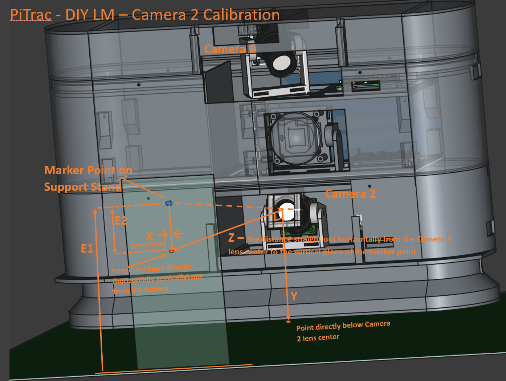

## Flight Camera

1. Note Flight Camera (bottom camera) closely follows the Tee Camera (Top Camera) calibration  
2. Lens Un-Distortion  
3. Measuring Distances and Angles  
    1. Remove the visible-light cut (long pass) filter from the front of the camera for now. It’s easier to calibrate the camera in the visible light spectrum.  
    2. Ensure that the triggering for the camera is not in external mode (where it usually will be when the Flight camera system is running).    
        - If necessary, do: `sudo /CameraTools/setCameraTriggerInternal.sh`   
    3. Set up a marker point (such as a cross hairs) on a piece of paper attached to an object or stand so that the point is about 15 cm above the ground and roughly centered in the view of the camera with the camera at a slight upward tilt and facing straight out.  The point should be a shape that will be crisp, sharp, and useful for focusing the camera.  
    4. Follow the instructions for Tee Camera (read that first), below, but use the following modifications when recording the various measurements:  
    5. 
       
    6. Flight Camera Measurements (values are typical/exemplary)  
    7. -X (the negative value of X) is the distance to the left (looking at the monitor) from the point on the floor directly under the center of *Flight camera* (facing the LM as a right-handed golfer) to the marker dot. ***It’s usually 0*** because the point will be centered (horizontally) in the camera’s view. Because this is relative to the OTHER camera, X will usually effectively be `~-3` or `–4` centimeters away from the other camera because the Tee camera is offset because it is twisted.    
        1. This will be made up later when we set the 
        `"kCamera2OffsetFromCamera1OriginMeters" parameter: [ **0.03**, -0.19, 0.0 ],`
        2. `X = 0.0` (typical) 
    8. Y is the distance from the center of the Flight camera lens to the level of the hitting mat (for Tee camera)  
        1. `Y = .109`  (typical)  
    9. Z is the distance ***straight out horizontally-level*** from the front of the lens to the vertical plane of the marker.  This measurement is ***not*** “as the crow flies” in a straight line from the lens to the marker point.  See pictures.  The front of the camera lens is `~1cm` back from the bottom of the base, which may be helpful if you are measuring from the bottom of the base.  
        1. `Z = .55` (typical)  
    10. E1 is the elevation from the floor or mat to the marker point in the air. Somewhat above the Y value.  
        1. `E1 = 0.16` 
    11. E2 is the elevation from Flight camera to the marker point in the air.  E2 will be entered into the PiTrac JSON configuration file as the 2nd parameter for e.g.,  `"kCamera2PositionsFromOriginMeters": [ 0.0, **-0.051,** 0.46 ]`  
        1. `E2 = E1 - Y = 0.051`.  
        2. This will help calculate the YDeg angle.  However, because of measurement inaccuracy, it may still be necessary to manually adjust that angle. [TBD]  
    12. H is the distance from the camera lens directly (as the crow flies) to the marker point.   
        1. `H = .56`
    13. In the Calibration Spreadsheet, `X_Degrees` will normally be `0` (camera facing straight out).  Conversely, `Y_Degrees = ATAN(E-Y)` and will usually be around `5` degrees (camera tilted slightly upward in order to catch fast-rising balls) (`5.3` degrees for the above example values)  
    14. Otherwise, this process same as for Tee camera, but due to the (typical) either horizontal or up-facing camera, will have to create a marker-aiming spot in mid-air by drawing on a box or something that can be propped up in front of the Flight camera  
    15. Enter the following data into the JSON file:  
        1. `"calibration.kCamera2CalibrationDistanceToBall": <Z>`  (e.g., 0.55)  
        2. `"cameras.kCamera2PositionsFromOriginMeters": [<X>, -<E2>, <Z> ]`  
        3. `"kCamera2Angles": [ <XDeg>, <YDeg, e.g. 6.3 degrees> ]`,  (from spreadsheet)  
        
----