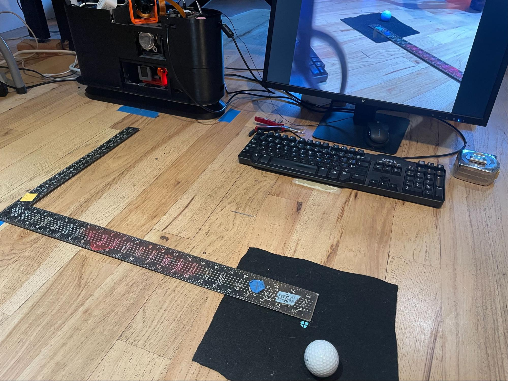
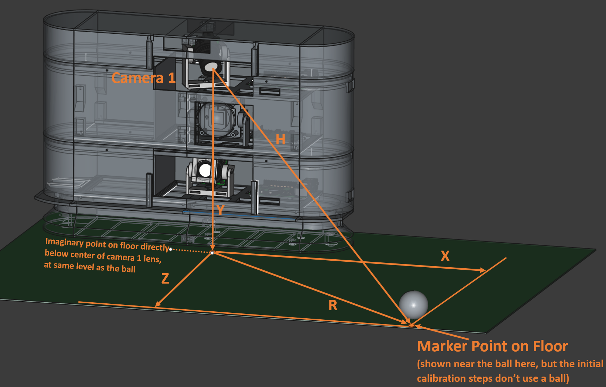

## Tee Camera (Top Camera)

Tee camera distances and angles (also referenced by and relevant for Flight camera process)  

1. Only for Tee camera, plug in the exterior LED strip at the bottom of the launch monitor. For these calibration steps, the more light the better.  
2. Start the `previewGS.sh` script (which runs libcamera.hello) for Tee camera, or `previewGS_noir.sh` script for Flight camera.  This will allow you to see the marker in real time as the camera is positioned and focused.  
3. Pick an appropriate nominal tee-up spot to use as the calibration marker point for flight camera.  The exact placement is not important, but positioning the ball near where it will be teed should help make the calibration more accurate.  
   1. Typical is `60cm` to the right and around `50-60cm` in front of the LM (looking at the LM from where the player would stand, looking down into its cameras). Other distances can work as well, but the balance is between being close enough to get a good view of the ball, and far enough that the field of view is sufficiently broad to capture enough (at least 4) image imprints as the strobe light fires.
4. Use a tape measure to accurately determine the position from the front-center of the LM to the point where the ball will be expected to be teed up as follows:  
   1. Note - The ball will likely be right in front of Flight camera (and a `10-20cm` in the air), but for Tee camera, it will be a couple feet to the right and on the ground.  
   2. Further back (to the right of the LM for right-handed golfers) gives more time for the LM to “see” a fast ball in the Flight camera before it goes too far.  The LM should be able to operate regardless of exactly where the marker point is, but a point close to the typical tee-off makes the calibration in that area more accurate.  
   3. Place a marker (e.g., a sticky-note with a `3mm` dot or crosshair) at the point on the ground where the nominal tee point will be.  If you are calibrating on a hitting mat. A short bit of wire insulation pushed into the hitting mat works well, too.  The point just has to be well enough marked to be able to see it in the center of the preview screen.  
   4. Tee camera Example Setup:  
      - 
5. Loosen and then move the camera mount until the preview screen on the monitor shows the marker dot directly behind the taped-on dot on the monitor.  The idea is to center the marker in the camera view so that the camera is known to be aimed directly at the spot.  Continue to keep the point centered as you tighten the gimbal screws (a small 90-degree M4 hex wrench makes this easier).  
   1. **NOTE** - Sometimes the mount is sticky and only wants to point to a particular point near, but not at the marker.  In that case, let the camera do what it wants to do, and just re-measure where the point is (it might be a few millimeters one way or the other), and then use those measurements, below.  
   2. When tightening the base of the Pi for Tee camera (top floor), you may have to loosen and move the strobe light that is immediately below the camera to get room to use a needle-nose pliers to tighten the bold.   
6. Measure the following distances from the camera being calibrated to the marker. **NOTE** these values have slightly different definitions for Flight camera. Reference that process elsewhere in this document when calibrating that camera.  
   1. Refer to the following diagram regarding the necessary calibration measurements for Tee camera:  
   2.  
   3. X is distance to the right of the LM (facing the LM as a right-handed golfer) to the marker point  
      1. `X = .60` (typical) (distances here are in meters)  
      2. For Flight camera, the X should reflect the effective X-axis difference between the two cameras (because Tee camera is twisted to one side from center). So, even if the Flight camera is centered, it’s X is likely to be 3 or 4 cm.  
      3. The “Origin” referenced in the .json file (e.g., `kCamera1PositionsFromOriginMeters` is technically arbitrary, but this system considers it as the point on the floor directly below where the Tee camera (or Flight camera) is focused.  
   4. Y is the distance from the middle of the Tee camera lens to the level of the hitting mat (for Tee camera) or the aiming point (for Flight camera).  
      1. `Y = .275` (typical)    
   5. Z is the distance straight out from the front of the LM unit to the plane of the marker  
      1. `Z = .56` 
   6. R is the distance from the point on the floor directly below the front center of the camera lens to the marker point on the floor (see diagram above).  This is one side of a triangle, with the other two sides being the line from the camera to the point on the floor, and the third side as “H”, below.  
      1. `R = .83`  
      2. NOTE - because of the tilt angle of Tee camera, the point on the floor will technically be hidden below the base of the LM.  Usually, we just measure from the edge of the base and add the additional couple of centimeters to make up for the offset.  For the same reason, the X distance on the floor for that camera will be a few centimeters less than the same point would be for Flight camera   
   7. H is the distance from the camera lens direct (as the crow flies) to the marker point  
      1. `H = .87`  
   8. Set the X, Y and Z values in the configuration .JSON file: (below values are typical)  
      1. (in “cameras” section) `"kCamera1PositionsFromOriginMeters": [ <X>, <Y>, <Z> ]` for example, `[0.60, 0.275, 0.56 ]`,   (x,y and z in cm), and  
      2. `"kCamera1Angles": [ <XDeg>, <YDeg> ]`, for example, `[46.97, -17.44]`  (from spreadsheet)  
   
----