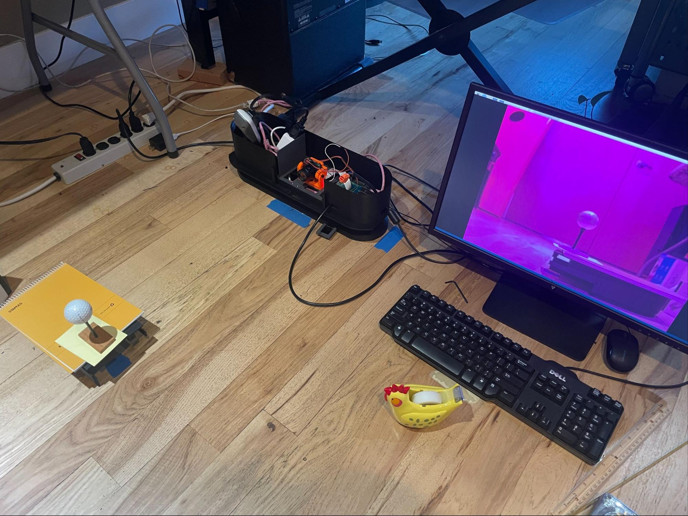
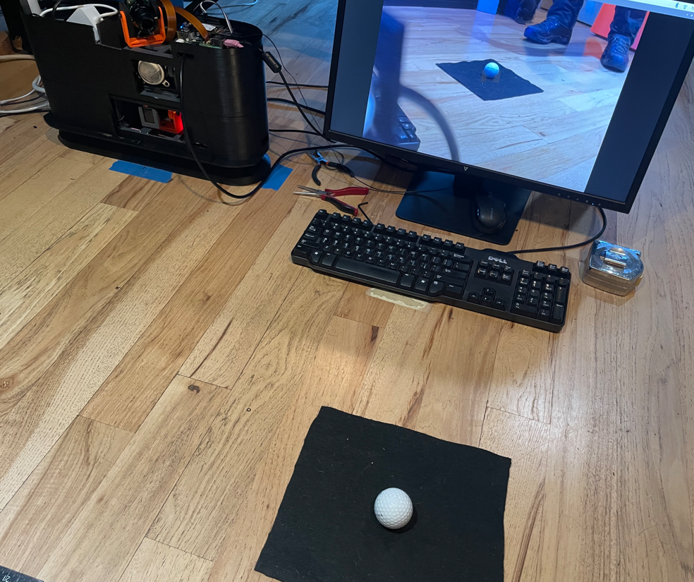

## Determine the camera’s focal length 

1. Place a ball on or at the marker.    
   1. For Tee camera, the ball will be immediately above the marker.    
   2. For Flight camera, create a support that will hold the ball so that its center in space is where the marker point existed in space before it was replaced by an actual ball.  Put the   
   3. Example setups:  Flight camera:  
   4.  
   5. Tee camera:  
   6.  
2. Ensure that the area around the ball has good contrast.  For example, put down some black felt around the ball or use a white ball on a green hitting mat.   
3. For Tee camera, turn the LED strip on the LM base on to make sure there’s sufficient light for good exposures.  
4. Re-Measure H to ensure it’s correct - it is the distance on a line straight out from the camera lens to the ball center (at or near where the marker point was)  
5. Set the H distance into the appropriate parameter in the “calibration” section of the `golf_sim_config.json` file:   
   1. For Tee camera, `"kCamera1CalibrationDistanceToBall"`.  `~87cm` is typical   
   2. For Flight camera, `"kCamera2CalibrationDistanceToBall"`. `~55cm` is typical  
6. For Flight camera, install the light filter and holder on the lens.  
7. Focus the lens as well as possible and lock in the focus by tightening the thumb screw closest to the camera (the other screw should already have been tightened).  Using the brand-marking or number printed on the ball can help this process.  This will establish the focal distance in the next step.  
8. IF NOT ALREADY DONE AT LEAST ONCE, PERFORM CAMERA LENS UNDISTORTION PROCESS (other section) 
9. Ensure the ball is well-lit, especially near its bottom.  
   1. For Flight camera, getting as much sunlight in as possible can help provide sufficient IR to see well, or an incandescent light can also help.  
10. Run the `“runCam1Calibration.sh”` or `“runCam2Calibration.sh”` script to get the focal length.    
      1. It will take multiple measurements and average them.  This will take a minute or so.  
11. Set the resulting focal length into the .JSON file.    
      1. E.g., `"kCamera1FocalLength": 5.216` would be typical  
8. Determine the x & y (pan and tilt) camera1 angles for the configuration .JSON file  
1. [See [https://docs.google.com/spreadsheets/d/1igc2V7oq-hGpFP5AKGjyzc2osLVpYHp969iPyHGttJ8/edit\#gid=423758471](https://docs.google.com/spreadsheets/d/1igc2V7oq-hGpFP5AKGjyzc2osLVpYHp969iPyHGttJ8/edit#gid=423758471) for automatic calculations]  
2. X/pan is positive as the camera twists to face back to where the ball is teed (as the camera goes counter-clockwise viewed from above the LM).    
3. Y/tilt  is negative as the camera starts to face down.   
4. The angles are measured from the bore of the camera if it were facing straight out at no angle and level with the ground  
5. XDeg = 90 - atan(Z/X)   YDeg = -(90 - asin(R/H))   OR, for camera2, YDeg = ATan(Y/R), e.g, atan(4.5/40) = 6.42.   
   1. For example, for Tee camera:  
      1. `XDeg = 56.31 , YDeg = -24.46`  
   2. For example, for Flight camera:  
      1. `X = -0.03  Y = 0.13  Z = 0.40 H = 0.42  R =`    
6. Set the values in the configuration .JSON file:  
   1. (in “cameras” section) `"kCamera1Angles": [ 54.7, -22.2 ]`,   (x,y  or pan, tilt)  
9. Place a ball ball near the mark on the tee-up spot so that there is a straight line from the camera to the mark that runs through the center of the ball (thus the ball will be slightly in front of the marker)  
10. Measure the distances to the center of the ball  
11. In the JSON file, set calibration.kCamera1CalibrationDistanceToBall to the distance to the ball in meters, e.g,. 0.81   
12. Run `“runCam1BallLocation.sh”` script to make sure the angles and distances and processing are correct  
   1. The ball-search location should work in the center:   `--search_center_x 723 --search_center_y 544`. If the script doesn’t return values, check the `log_view_final_search_image_for_Hough.png` file.  
   2. Remember, that the distances will be approximately to the center of the ball FROM THE CAMERA, so will be a little shorter than the distance to the LM in the X direction. 
        
----