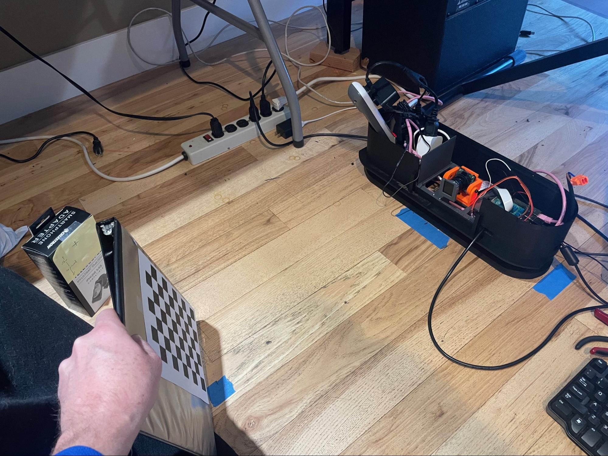
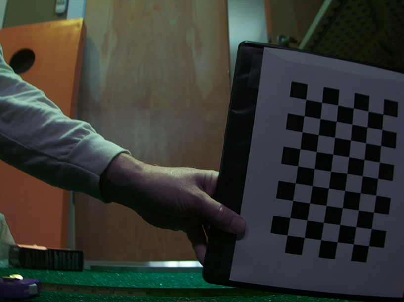
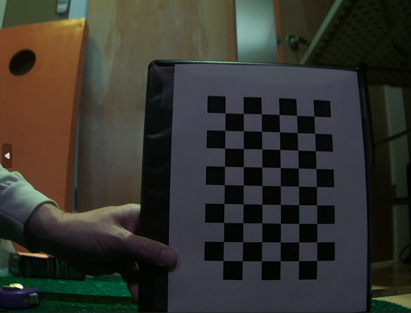
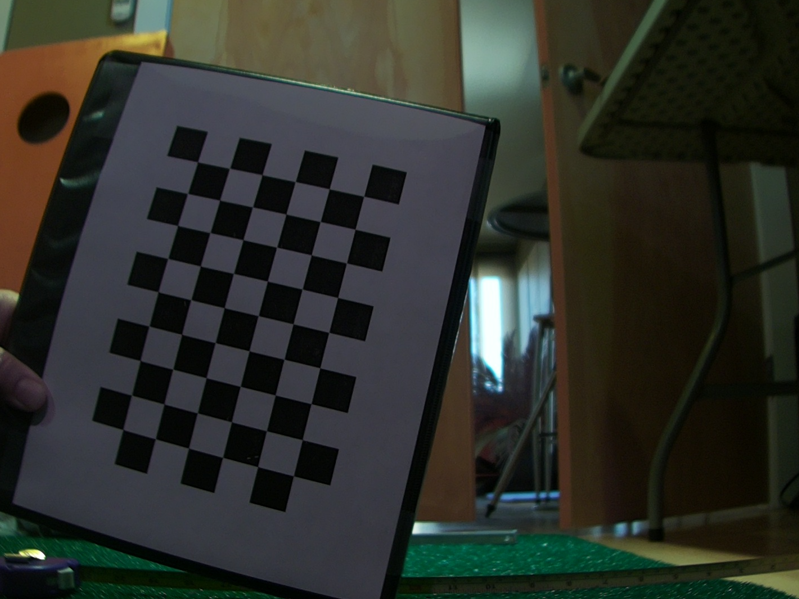
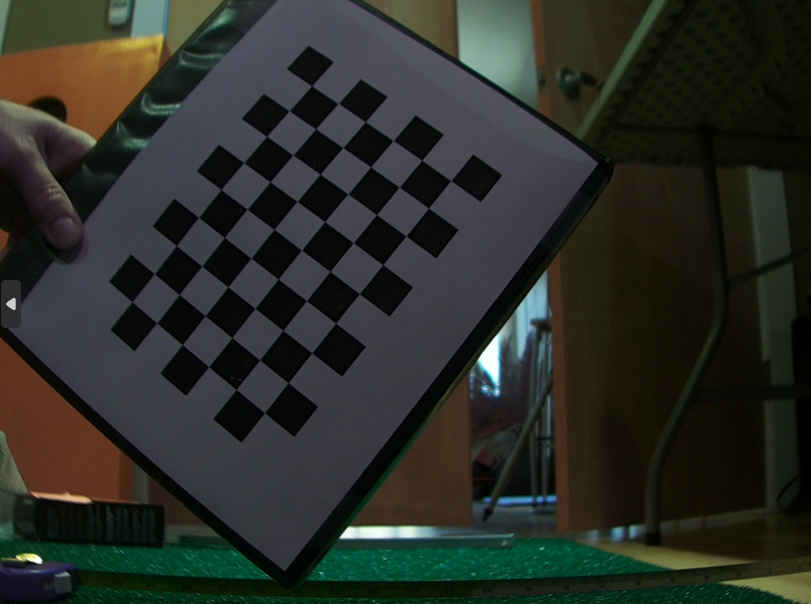

## Camera Lens "Undistortion" Process

A camera lens undistortion process involves first calibrating the camera to determine the lens distortion parameters (like radial and tangential distortion coefficients), then using those parameters to mathematically map the distorted pixels in an image to their correct positions, creating an undistorted output image; this typically requires capturing images of a known pattern (like a checkerboard) to accurately calculate the distortion parameters.

Camera Calibration and Geometry. Basics of camera geometry and how it can be used to calibrate cameras. 

<iframe width="640" height="420" src="https://www.youtube.com/embed/_-BTKiamRTg" frameborder="0" allowfullscreen></iframe>

- Here is another video performing a camera calibration in OpenCV using python in VS Code: 
<iframe width="640" height="420" src="https://www.youtube.com/embed/H5qbRTikxI4" frameborder="0" allowfullscreen></iframe>


1. The undistortion code and scripts are under the `CalibrateCameraDistortions` folder.  The scripts rely upon the libcamera-still utility, so make sure that is working first.  
2. Print out a copy of the `7x10` square checker board included in that directory on a sheet of paper. Note that you want to print it to scale.  Mount the checkerboard on a piece of cardboard or slip it into a binder so that you can easily hold it and it will stay flat.    
3. When calibrating Flight camera, adding a bright incandescent light can provide additional IR light to help make the images clearer. Also, change the tuning file in the `take_calibration_shots.sh` script from:  
   1.  `--tuning-file=/usr/share/libcamera/ipa/rpi/pisp/imx296.json`  to  
   2.  `--tuning-file=/usr/share/libcamera/ipa/rpi/vc4/imx296_noir.json` (the _noir is only applicable for Flight camera)  
4. When calibrating Tee camera, ensure the room is well lit. Turning on the LED strips on the LM often produces too much light and reflection.  
5. To take the pictures, make sure your camera is focused at the distance of where the ball will be.  It’s best to have the Pi console window visible so that you can see when to move the board and avoid blurs.   
6. Next, we need a bunch of images of the checkerboard at about the distance we expect the golf ball to be imaged by the cameras.  These images should include the board in the middle and nearer the edges of the images, and must each include all of the checkerboard, not just a part of it.  
7. Sample setup   
   1.    
8. Then, run the `take_calibration_shots.sh` script, specifying, for example, `./images/cam1` as the output directory.  Twenty pictures is usually sufficient.    
   1. → `mkdir images/cam2` for flight camera 
   2. → `take_calibration_shots.sh` ./images/cam2/gs_calibation_20`  
9. The script will repeatedly pause and take a picture and save it to the output directory.  Each time the script says “READY”, quickly move the checkerboard to a new location.  Each move, try to rotate the board a little bit about the image plane so that it is in a different orientation each time.  Also, try tilting the board a little forward and back randomly.  This should result in a set of images that are named `gs_calibrate_<nn>`, where nn is an increasing number. The images should look like:  
10. 
11. Look through the images and delete any where the checkerboard is not fully visible.  Partially-visible board can stall the next step of this process.  
12. Now that the pictures are ready, run the python processing script on those pictures to come up with the matrices that will be necessary to setup the PiTrac configuration .json file.  To run, do:  
    1. First, edit the python script to point to the images just gathered, for example:  
       1. `images = glob.glob('./images/cam1/*.png')` 
    2. → `rm caliResult*.png` (to remove any earlier calibration sanity-check files)  
    3. Pick an output image to use as a test case:  
       1. `cp images/cam2/gs_calibation_1.png` `test_image_for_undistortion.png`  
    4. → `python CameraCalibration.py`  
    5. Alternatively, there is a Visual Studio .sln solution file that you can open up in Studio to step through the code if there is a problem.  
13. After processing, there will be several files output to the current working directory.  If you compare `test_image_for_undistortion` and `caliResult2.png`, you can see the before and after results of applying the computed un-distortion matrices.  The un-distorted picture should have each checkerboard square look the same size and they should look square, not rounded.  The lines of rows and columns should be straight in the undistorted image.  caliResult1.png shows how the original image is “warped” to un-distort it  
14. If that looks good, take the information in the files `distortion.txt` and `cameraMatrix.txt` and copy the values into the two parameters below (changing `Camera2` (Flight camera) for `Camera1` (Tee camera) if this is for Flight camera).  These parameters are in the “cameras” subsection of `golf_sim_config.json`:  

    ``` json
    "kCamera1CalibrationMatrix": [ 
    [ 1.748506644661262953e+03, 0.000000000000000000e+00, 6.325374407393054526e+02 ],  
    [ 0.000000000000000000e+00, 1.743341748687922745e+03, 4.075677927449370941e+02 ],  
    [ 0.000000000000000000e+00, 0.000000000000000000e+00, 1.000000000000000000e+00 ]],  
    ```
    `"kCamera1DistortionVector": [  -0.504763   0.173410   0.001554   0.000916   0.355220 ]`,

15. Do the same for Tee camera and Flight camera